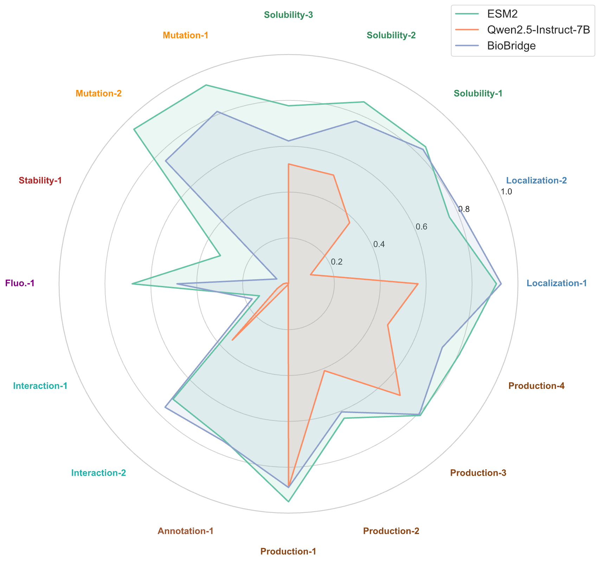



[Paper](https://arxiv.org/abs/2602.17680)

## Abstract
BioBridge addresses a long-standing mismatch in scientific AI: general large language models are strong at reasoning and contextual learning, but they do not understand proteins; protein language models are strong at specialist tasks such as structure-related prediction and function annotation, but they are far weaker at cross-task generalization and complex scientific reasoning.

`BioBridge: Bridging Proteins and Language for Enhanced Biological Reasoning with LLMs` does not try to solve this by naively feeding protein sequences into an LLM. Instead, it lets a specialist protein model first read the protein, then maps that information into a semantic space the LLM can actually reason over. The result is a framework that pushes a general LLM much closer to expert-level protein understanding without giving up its original general ability.

## Why Existing Models Fail on Real Biological Tasks
The problem here is not just benchmark score chasing. The original write-up correctly points out a deeper issue: many current models look strong on evaluation sets, but fall apart on real scientific tasks.

- Specialist protein models are powerful on narrow tasks, yet remain poor at cross-task transfer and natural-language explanation.
- General LLMs are strong at reasoning and language, but cannot interpret protein sequences as a structured scientific modality.
- Conventional full-parameter fine-tuning often triggers catastrophic forgetting: domain knowledge improves, but general reasoning and language understanding degrade.

This is why many models can appear fluent in biological QA but still underperform badly on target identification, solubility analysis, or protein interaction benchmarks.

## Three Core Bottlenecks
The paper frames the difficulty across three layers:

- `generalization barrier`: performance on standard benchmarks does not transfer reliably across species, functions, and real downstream scenarios
- `modality gap`: protein sequences carry structural and functional semantics that ordinary text tokenizers cannot parse
- `capability conflict`: adding specialist knowledge to a general model often damages its original general-purpose competence

BioBridge matters because it treats these as a unified systems problem instead of patching them one by one.

## Three Core Innovations in BioBridge
The architecture can be understood in three layers.

### 1. Domain-Incremental Continual Pretraining
The first issue is that an LLM usually lacks even basic biological grounding. BioBridge therefore uses a domain-incremental continual pretraining strategy over a curated biomedical corpus spanning textbooks, PubMed papers, and Swiss-Prot protein-description pairs, with replay mechanisms to preserve prior reasoning skills.

The goal is not to overwrite the base model, but to let it absorb protein-related knowledge while retaining its original strengths in math, code, and scientific reasoning.

### 2. Protein-Language Semantic Alignment via PLM-Projector
The second issue is that protein models and language models do not speak the same language.

BioBridge uses `ESM2` as the protein encoder, then applies a lightweight projector to map protein representations into the LLM's language semantic space. Contrastive learning is used to align protein sequences with biological text descriptions at a deeper semantic level.

This is a crucial design choice: proteins are not treated as plain strings, but as specialist representations translated into something the LLM can reason about.

### 3. End-to-End Multitask Fine-Tuning
Finally, BioBridge concatenates protein embeddings and text instructions into a unified multimodal input and trains the model end to end in a generative way. A particularly important point from the source write-up is that this enables strong downstream behavior without relying on task-specific labeled datasets, using only protein-text supervision.

That makes the framework feel less like a benchmark-specific trick and more like a scalable route toward domain-specialized scientific LLMs.

## Results: A General Model Finally Approaches Specialist Protein Models
The experimental results lead to two main conclusions.

### Stronger specialist performance
On core protein tasks such as enzyme classification, subcellular localization, and metal-ion binding, BioBridge improves over `Qwen2.5-7B-Instruct` by more than `7%` on average. On protein-drug binding strength prediction, it reaches performance close to the specialist protein model `ESM2`.

This is important because it suggests that a general LLM is no longer merely imitating biological language, but starting to make genuinely specialist-quality judgments.

### General capability is largely preserved
Just as important, BioBridge retains the original model's general-purpose behavior. On benchmarks such as `MMLU` and `RACE`, it stays close to the base `Qwen2.5-7B-Instruct` while clearly outperforming models that are only specialized for protein tasks.

That is the core achievement of the framework: not specialist ability instead of generality, but as much of both as possible.

## What the Ablations Show
The source text also highlights two ablation findings:

- removing the biological pretraining stage causes a clear drop in downstream biology performance, showing that general LLMs do not naturally acquire deep biological semantics on their own
- removing the `ESM2 + Projector` alignment path and feeding raw sequences directly as text into the LLM causes a sharp degradation, confirming that cross-modal alignment is essential rather than incidental

So the gains are not coming from a single lucky trick. They come from the coordinated design of specialist reading, semantic alignment, and general reasoning.

## A Professional Transformation of General LLMs
The broader significance of BioBridge is not just that it improves protein modeling. It validates a more general route for scientific intelligence:

- specialist small models read and encode domain knowledge
- general LLMs handle explanation, reasoning, and transfer
- lightweight alignment modules and continual learning connect the two

If this pattern extends further, it should not be limited to proteins. It could become a broader recipe for chemistry, materials, medicine, and other scientific domains. In that sense, BioBridge is less a one-off biological system and more an early example of how general LLMs can undergo scalable professionalization through collaboration with domain models.

## Related Links
- Paper: [https://arxiv.org/abs/2602.17680](https://arxiv.org/abs/2602.17680)
