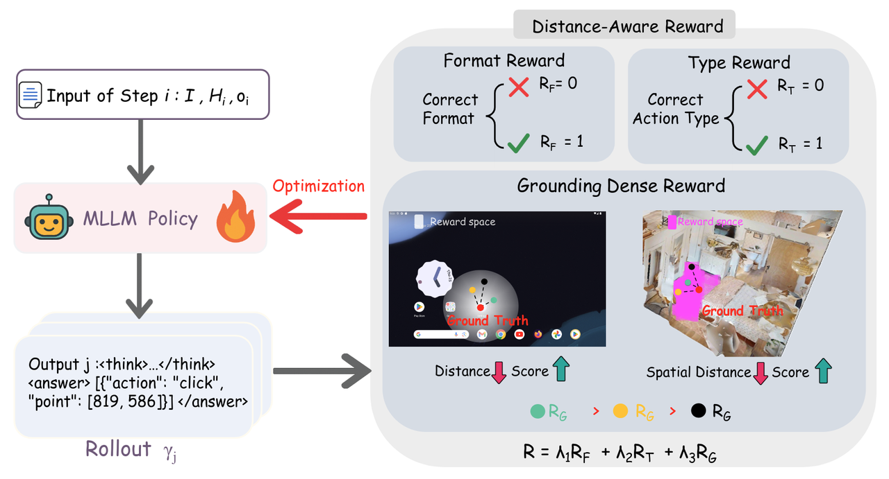
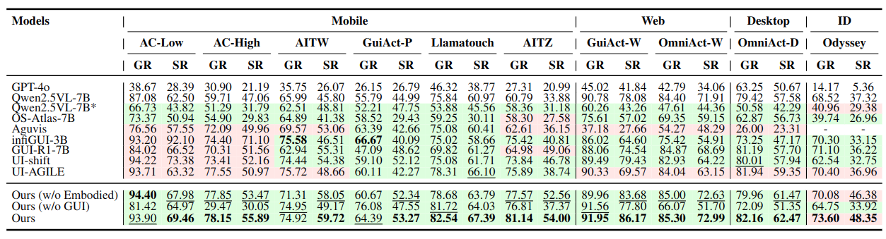
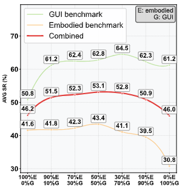
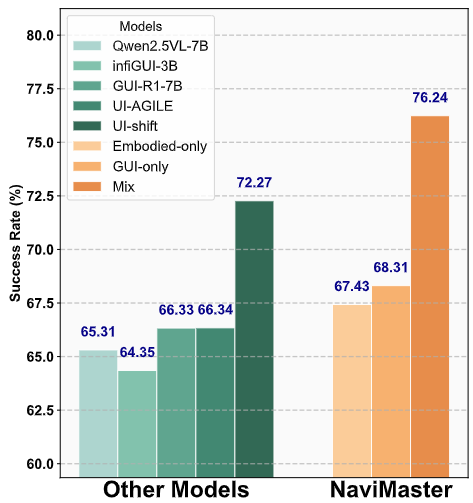
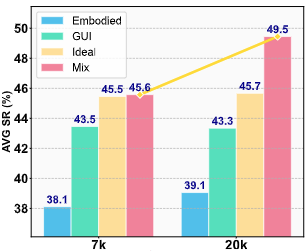
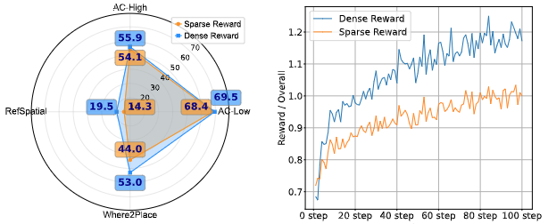



[Paper](https://arxiv.org/abs/2508.02046) | [Project Page](https://iron-boyy.github.io/navimaster/)

## Abstract
Navigation now happens in two worlds at once: digital interfaces such as mobile, desktop, and web GUIs, and embodied environments that require movement, localization, and interaction in physical or simulated space. Although both are fundamentally navigation problems, they have long been studied through separate datasets, separate action spaces, and separate training pipelines.

That separation creates several practical bottlenecks:

- separate models increase system cost
- cross-domain generalization remains weak
- sparse RL rewards slow training down
- models often reason correctly but execute poorly

NaviMaster tackles this fragmentation by introducing a unified navigation agent that learns GUI navigation and embodied navigation under the same framework. Through a shared trajectory formulation, a unified RL pipeline, and distance-aware dense rewards, it substantially improves cross-task generalization, optimization efficiency, and grounding precision.

## Task Demos

### Spatial Grounding
The model predicts a target point directly from visual context and language constraints.



### GUI Navigation
The agent interacts with interfaces through multi-step actions such as click, type, and wait.



### Mixed GUI and Embodied Interaction
NaviMaster can also combine navigation and action execution in more complex settings such as Minecraft.



## Why Unify GUI and Embodied Navigation
Existing systems usually treat GUI navigation and embodied navigation as different task families. GUI agents operate through clicks and scrolling, while embodied agents rely on movement, viewpoint shifts, and spatial control. Even if both can be abstracted as Markov decision processes, their data formats and training pipelines remain hard to merge.

NaviMaster starts from a different premise: once actions, goals, and trajectories are aligned, both domains can be learned together as one navigation problem. This turns GUI and embodied data into complementary supervision instead of isolated silos.

## Three Core Innovations

### 1. A Unified Visual-Goal Trajectory Formulation
The first challenge is that GUI trajectories and embodied trajectories do not share a common language. NaviMaster resolves this by converting both into a unified visual-goal trajectory format.

The action space is systematically aligned:

- task-specific actions are preserved and inserted into a shared action vocabulary
- GUI `[SCROLL]` and embodied `[TURN]` actions are both discretized into directional changes
- GUI `[CLICK(x, y)]` and embodied movement actions are unified through explicit target-point actions such as `[MOVETO(x, y)]`

GUI trajectories are built from existing datasets such as GUI-Odyssey, while embodied trajectories are derived from shortest-path keypoints extracted with A* search and then converted into visual-goal action sequences. NaviMaster also adds reasoning intents for each step, generated with GPT-4o, so history contains not only actions but also why those actions were taken.

### 2. A Unified Reinforcement Learning Framework
Once trajectories are aligned, NaviMaster trains directly with GRPO on mixed GUI and embodied data instead of using separate warm-start pipelines. Both domains are treated as the same decision process: given an observation, an instruction, and execution history, the model selects the next action from a language-defined action space.

This allows one policy to learn from 2D GUI data and 3D embodied data together, strengthening cross-domain generalization rather than overfitting to a single environment family.

### 3. Distance-Aware Dense Rewards
To address sparse supervision, NaviMaster decomposes success into three components:

- whether the output is executable
- whether the action type is correct
- whether the predicted target is sufficiently close to the ground truth

Instead of binary success-or-failure signals, the model receives graded feedback based on how close it is to the target. This makes learning more stable, reduces useless exploration, and improves convergence speed.

## Experimental Highlights

### GUI Navigation
NaviMaster shows strong out-of-domain generalization on GUI tasks. Evaluation is performed entirely on OOD test sets isolated from the training distribution. Against strong baselines, NaviMaster consistently improves success rate across mobile, web, and desktop benchmarks.

More importantly, mixed GUI-plus-embodied training outperforms training on only one domain, showing that the two data sources provide complementary navigation signals.

### Spatial Grounding
On four spatial grounding benchmarks, NaviMaster outperforms all baselines. The gains hold for both object-level reference and free-space pointing, showing that the model learns substantially stronger fine-grained visual-spatial alignment.

### Embodied Navigation
On embodied navigation tasks such as ObjectNav-unseen, NaviMaster also delivers clear improvements. Under the VLMNav framework, replacing only the base model is enough to reveal the contribution of the method. The results suggest that NaviMaster is the first agent model in this setting to demonstrate strong generalization.

Again, mixed training outperforms GUI-only or embodied-only variants, reinforcing the value of unified optimization.

## Deeper Analysis

### Mixing Ratio
Overall performance peaks when GUI and embodied data are mixed at roughly `5:5`, indicating that balanced cross-domain supervision is especially effective. Even under imbalanced ratios, mixed training typically still beats single-domain training.

### Gains Across Backbones
The method brings consistent improvements on multiple base models, including `Qwen2.5VL-7B`, `Qwen2.5VL-3B`, and `Qwen2VL-7B`, showing that the gains are not tied to one specific backbone.

### Data Scale and Reward Design
The unified training strategy remains effective at both smaller and larger data scales. Meanwhile, dense rewards converge faster than sparse rewards and also reach stronger final performance.

## NaviMaster as the Opening of Navigation Agents
NaviMaster is important not because it simply merges two benchmarks, but because it demonstrates a more natural route toward unified multimodal agents. A future agent should not need to be split into one that only clicks screens and another that only moves in physical space. It should be able to perceive, reason, and act across both.

From that perspective, NaviMaster is best seen as an early but meaningful step toward a broader class of unified agents.

## Related Links
- Paper: *NaviMaster: Learning a Unified Policy for GUI and Embodied Navigation Tasks*
- Project page: [https://iron-boyy.github.io/navimaster/](https://iron-boyy.github.io/navimaster/)
- This post is rewritten from the local `navimaster` folder materials, including the `.docx`, figures, and demo videos
