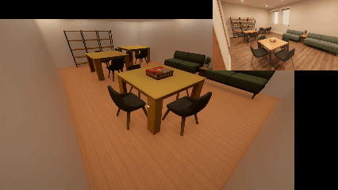
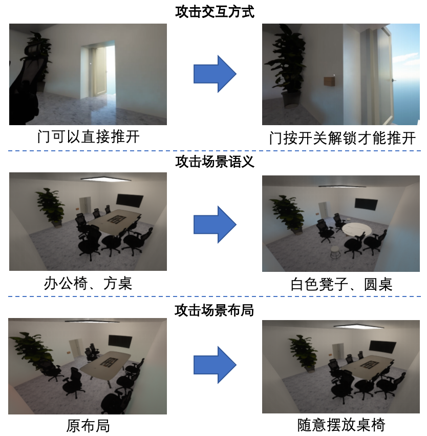



[GitHub Repository](https://github.com/AI45Lab/SafeVerse)

## Abstract
Safe and trustworthy embodied AI needs realistic testing grounds, but running attack-and-defense drills directly in the physical world is expensive, risky, and hard to reproduce. SafeVerse addresses this gap by first digitizing a specified real-world environment, then turning that twin world into an editable arena for safety evaluation, adversarial testing, and online reinforcement learning.

Unlike world models that mainly aim to generate plausible open-ended environments, SafeVerse focuses on reconstructing a particular real scene with low cost and high controllability. Its emphasis is not just realism, but operational realism: the reconstructed world should be interactive, editable, and useful for agent training and verification.

## Why SafeVerse Matters
Existing embodied environments often fall into one of two extremes:

- Traditional simulators rely heavily on manual asset construction, offer limited interactive objects, and struggle to reflect the diversity of real-world scenes.
- Generative world models can imagine rich environments, but they are not faithful twins of a user-specified home, office, or factory floor, so they are hard to use for targeted security drills.

SafeVerse starts from a more practical premise: what safety testing needs is not an imagined world, but a controllable digital twin of a real one. It therefore builds a three-step loop:

1. Reconstruct a real environment from video.
2. Edit that environment according to attack or evaluation goals.
3. Let the agent evolve online under continual adversarial pressure.

## Three Core Breakthroughs
The system is organized around three main capabilities:

- `Real-world Ctrl+C / Ctrl+V`: it tries to preserve not only appearance, but also structure, semantics, and interaction logic.
- `Minute-level construction with operable objects`: a short video can become an interactive 3D scene where doors open, lights switch, and furniture moves.
- `Unified evaluation, attack, and evolution`: the same environment can support testing, adversarial scene mutation, and online RL-based agent improvement.

This makes SafeVerse less like a standalone simulator and more like a digital twin infrastructure for trustworthy embodied intelligence.

## From Ordinary Video to an Interactive Twin World
The first step in SafeVerse is to make the system actually understand the source video. Instead of leaning on a purely geometric 3D optimization pipeline, it uses multimodal understanding to parse objects, layouts, and scene semantics, then maps them into operable 3D entities.

Built on top of Minecraft and its rich physical interaction rules, SafeVerse converts recognized scene elements into 3D objects with explicit interaction affordances. The result is not a static reconstructed set, but a sandbox where an embodied agent can enter, move, manipulate, and explore.

These four GIFs illustrate the pipeline from input video to interactive 3D environment. The key point of the original webpage is that SafeVerse makes `video in, operable twin out` practical at minute-level turnaround.

## Editing the Scene with Attack Instructions
Reconstruction alone is not enough for safety validation. The environment also needs to change in response to specific attack goals.

SafeVerse emphasizes a combination of realism and editability. Once a twin scene has been built, it can be modified directly for attack-and-defense scenarios, including:

- changing interaction properties, such as turning an ordinary door into one that must be unlocked first
- altering semantic cues, such as changing an object's appearance to mislead recognition
- perturbing spatial layout, such as repositioning furniture or obstacles to break a navigation plan

This allows attack vectors to be injected into the environment itself, creating more realistic and better targeted embodied stress tests.

## Online Evolution Against Discovered Vulnerabilities
SafeVerse does not stop at evaluation. It pushes the loop one step further toward online evolution.

Conventional embodied training often depends on fixed datasets and static scenes. When a new attack or environmental shift appears, agents can fail catastrophically. SafeVerse tries to solve this through a reconstruction-attack-defense loop: rebuild the scene, perturb it dynamically, and retrain the agent immediately after failure.

That means the agent is no longer tested in a frozen benchmark. It must adapt to changing layouts, newly inserted obstacles, altered object states, and other evolving threats in real time.

One example from the original page is especially clear: when a chair blocks the only path to the goal, the agent initially fails. After online training, it learns to recognize the obstacle, reroute, or even move the chair away. The point is not only that it encounters a failure, but that it can grow inside that failure.

## What This Work Shows
SafeVerse is not just another embodied simulator. Its main contribution is that it connects three capabilities into one loop: fast digitization of a specified real scene, attack-oriented scene editing, and online RL-based agent evolution.

Many embodied platforms are good at offering training spaces. SafeVerse is more specifically about offering safety drill spaces. It turns real-scene digitization into a working capability for safe and trustworthy embodied AI research.

## Related Links
- GitHub: [https://github.com/AI45Lab/SafeVerse](https://github.com/AI45Lab/SafeVerse)
- This post is rewritten into local Markdown from the SafeVerse webpage bundle stored in `/Users/wangxuhong/code/素材`
