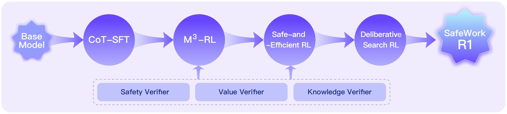



[Paper](https://arxiv.org/abs/2507.18576)

## Abstract
SafeWork-R1 is built around a specific claim: safety and capability do not have to trade off against each other. Instead of treating safety as a lightweight filter added after reasoning, this work introduces `SafeLadder`, a training framework that attempts to make safety part of the model's internal reasoning ability.

The resulting model, `SafeWork-R1`, is not just safer in the sense of being more conservative. It improves safety benchmark performance by `46.54%` over `Qwen2.5-VL-72B`, while also improving average performance by `13.45%` across seven general reasoning and multimodal benchmarks. The central message is therefore not `safety instead of ability`, but `safety together with ability`.

## Why Revisit the Relationship Between Safety and Capability
Reasoning-oriented large models have advanced rapidly in recent years, but the gap between capability and safety has also widened. Better problem solving does not automatically imply stronger compliance with ethical constraints, social norms, or trustworthy deployment requirements.

SafeWork-R1 is motivated by what the original page calls the `AI-45 Degree Law`: the desirable direction for model development is not pure capability growth on a single axis, but coordinated improvement along both capability and safety.

The main argument is straightforward: if the base model is strong enough and the training process is designed properly, safety and general competence need not be a zero-sum game.

## Safety and General Capability in SafeWork-R1
SafeWork-R1 is built on the SafeLadder framework, whose goal is to deeply integrate safety mechanisms into the native ability structure of multimodal models, rather than relying on superficial post hoc refusal layers.

Key results reported on the original page include:

- an average `46.54%` gain on safety benchmarks over `Qwen2.5-VL-72B`
- an average `13.45%` improvement across seven general benchmarks: `MMMU`, `MathVista`, `GPQA`, `Olympiad`, `Gaokao-MM`, `IFEVAL`, and `MM-IFEval`
- `70.94` on `MMMU`, `76.1` on `MathVista`, and `78.17` on `Gaokao-MM`
- successful transfer of SafeLadder to additional models such as `SafeWork-R1-InternVL-78B`, `SafeWork-R1-DeepSeek-70B`, and `SafeWork-R1-QwenVL-7B`

Taken together, these numbers suggest that SafeWork-R1 is not merely optimized for safety metrics at the expense of open-ended performance. It tries to lift both.

## The SafeLadder Technical Roadmap
SafeLadder uses a structured and progressive reinforcement-learning-based post-training pipeline to internalize safety as part of model capability. The original webpage breaks it into four stages:

1. `CoT-SFT`: chain-of-thought supervised fine-tuning as a cold start for long-form reasoning.
2. `M³-RL`: multimodal, multitask, multi-objective RL that progressively aligns safety, values, knowledge reliability, and general capability.
3. `Safe-and-Efficient RL`: reducing overthinking and treating reasoning efficiency itself as part of safety.
4. `Deliberative Search RL`: enabling the model to retrieve, verify, and filter external information during answering.

The page also mentions a scalable RL infrastructure named `SafeWork-T1`, designed for thousand-GPU-scale training with multiple validators and modular verification components.

## Core Functional Highlights
SafeWork-R1 is not only about safer outputs. It also emphasizes trustworthy reasoning and interaction. The webpage highlights three major capabilities:

- `Deliberative Search`: combining calibration and search so the model can verify and refine its own answer through RL-based multi-step reflection.
- `Inference-Time Alignment`: bringing professional value models into the generation process to constrain intermediate reasoning and final responses.
- `Human Intervention on Chain-of-Thought`: allowing users or supervisors to directly correct flawed reasoning steps so the model better aligns with desired logic, style, and values.

Together, these features show that the goal is not only to stop harmful behavior, but to produce reasoning processes that are themselves more reliable and controllable.

## Discussion and Outlook
The original page closes with several takeaways that are likely to matter beyond this specific model:

- `Safety and capability are not necessarily zero-sum`: with the right training design, they can co-evolve.
- `Reasoning efficiency is closely tied to safety`: overly long and redundant chains of thought can themselves introduce security and alignment risks.
- `Trustworthy interaction remains a long-term frontier`: future work needs better error correction, test-time adaptation, language calibration, and norm-aware interaction.

The broader significance of SafeWork-R1 is therefore not just that it releases a strong model, but that it presents a training path where safety is treated as part of reasoning ability rather than a patch applied after the fact.

## Related Links
- Paper: [https://arxiv.org/abs/2507.18576](https://arxiv.org/abs/2507.18576)
