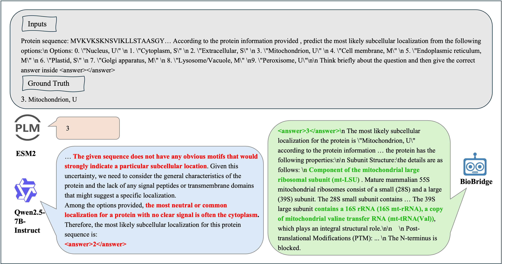
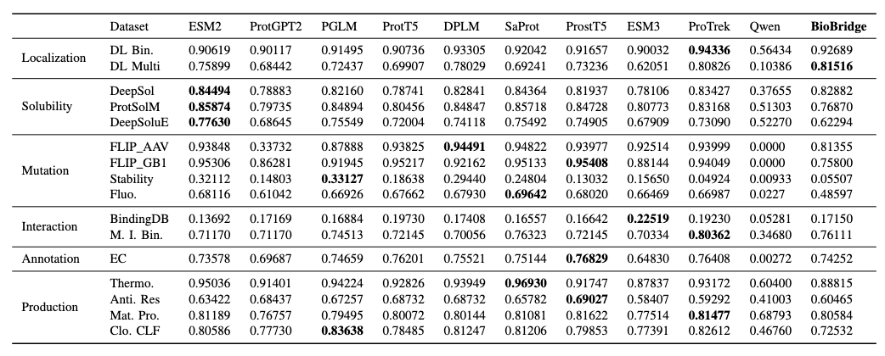
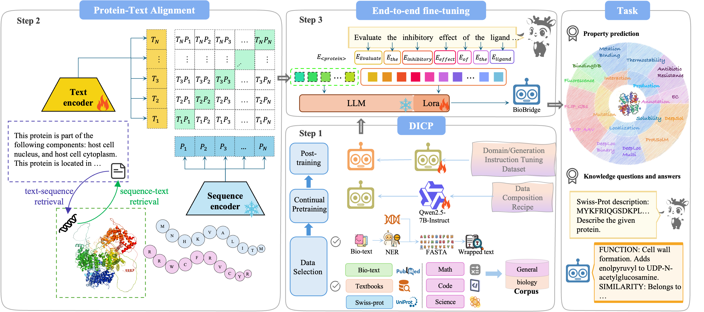



[论文链接](https://arxiv.org/abs/2602.17680)

## 摘要
BioBridge 关注的是一个很典型、但长期没有被真正解决的问题：通用大语言模型擅长推理和上下文学习，却不懂蛋白质；蛋白质语言模型擅长结构预测、功能注释等专业任务，却很难跨任务泛化，更难承担复杂科学推理。

《BioBridge: Bridging Proteins and Language for Enhanced Biological Reasoning with LLMs》给出的答案不是简单地把蛋白质序列喂给 LLM，而是先让专业蛋白质模型负责“读懂蛋白”，再把这些信息映射到 LLM 可用的语义空间，让大模型专注于解释、推理和跨任务迁移。

这条路线的关键在于：在不牺牲通用能力的前提下，把通用大模型真正推进到接近专家级的蛋白质理解水平。

## 为什么现有模型在真实生物任务上集体失语
原始软文点得很准。当前模型的困境不是 benchmark 上分不够高，而是“评测强、落地弱”。

- 专业蛋白质模型在特定任务上很强，但通常只能做单项任务，泛化和解释能力都有限。
- 通用 LLM 在文本推理和自然语言表达上很强，但看不懂蛋白质序列这种高度结构化、非自然语言的“另一种语言”。
- 一旦试图用传统全参数微调给 LLM 注入生物知识，又很容易引发灾难性遗忘，专业性上来了，通用性却掉下去。

这也是为什么很多模型在生物问答评测里看起来还行，但一到靶点识别、溶解度分析、蛋白质相互作用等真实任务上就明显掉线。

## 现有方法的三个核心瓶颈
从这篇工作的问题定义出发，瓶颈主要集中在三个层面：

- `泛化壁垒`：标准测试集上的分数无法外推到跨物种、跨功能、跨任务的真实研究场景。
- `模态鸿沟`：蛋白质序列包含折叠、结构和功能语义，传统文本 tokenizer 无法直接解析。
- `能力冲突`：把专业知识硬塞给通用模型，往往会损伤原有的语言理解和通用推理能力。

BioBridge 的核心价值，就在于它没有把这三个问题拆开零散修补，而是试图用统一的训练框架一起处理。

## BioBridge 的三类核心创新
这篇工作的设计可以概括为三层。

### 1. 领域增量持续预训练 DICP
BioBridge 首先解决“LLM 对蛋白质没有基本常识”的问题。为此，团队构建了多源生物医学语料，包括教科书、PubMed 论文和 Swiss-Prot 蛋白质描述对等，再通过带回放机制的领域增量持续预训练，把生物知识注入模型，同时尽量保留原有的数学、代码和科学推理能力。

它的关键点不是一股脑微调，而是让模型“增量学习”，做到既懂蛋白，又不忘原本擅长的推理任务。

### 2. 蛋白质-语言语义对齐模块 PLM-Projector
第二层解决的是“蛋白质模型和语言模型说的不是一种语言”。

BioBridge 以 `ESM2` 作为蛋白质编码器，先提取蛋白质表征，再通过轻量级投影头把这些表征映射到 LLM 的语言语义空间。借助对比学习，模型逐步建立蛋白质序列与生物文本描述之间的深层对应关系。

这一步非常关键，因为它并不是把序列当成普通字符串处理，而是把专业蛋白质表示真正翻译成大模型能理解和推理的中间语义。

### 3. 端到端多任务微调
最后，BioBridge 把蛋白质嵌入和文本指令拼接为统一多模态输入，直接进行端到端生成式训练。原文强调的一点很有代表性：无需下游任务标注数据，只依赖蛋白质-文本对监督，就能让模型自然涌现出定位、功能注释、突变效应预测等多类任务能力。

这说明它不只是“针对某个数据集刷分”，而是在训练范式上更接近一种通用科学大模型的专业化路径。

## 实验结果：通用模型首次逼近专业蛋白质模型
BioBridge 的实验结果有两个最重要的结论。

### 专业能力显著增强
在酶分类、亚细胞定位、金属离子结合等蛋白质核心任务上，BioBridge 相比原版 `Qwen2.5-7B-Instruct` 平均提升超过 `7%`。在蛋白质与药物分子结合强度预测任务上，它甚至达到了接近专用蛋白质模型 `ESM2` 的水平。

这意味着通用 LLM 第一次在真正的生物专业任务上，开始接近专家模型的判断质量。

### 通用能力基本无损
另一条更难得。在注入大量生物知识后，BioBridge 在 `MMLU`、`RACE` 等通用语言理解任务上的表现与原版 Qwen2.5-7B-Instruct 基本持平，同时显著优于那些只专精蛋白质任务的模型。

这正是这篇工作最重要的地方：不是拿通用能力换专业能力，而是尽量做到“两者兼得”。

## 消融实验说明了什么
原文还特别强调了两个消融结论：

- 如果去掉非语言模型的生物预训练环节，模型在生物任务上的性能会明显下降，说明通用 LLM 本身并不能自然掌握深层生物语义。
- 如果去掉 `ESM2 + Projector` 这一层，仅把蛋白质序列当成普通文本输入 LLM，效果会急剧劣化，说明跨模态语义对齐是关键，而不是可有可无的工程细节。

换句话说，BioBridge 的提升不是来自某个偶然技巧，而是来自“专业读取 + 语义对齐 + 通用推理”这一整套协同设计。

## 通用大模型的专业蜕变
BioBridge 的意义不只是做出一个在蛋白质任务上更强的模型，而是验证了一条更有普适性的路线：

- 专业小模型负责读取和编码领域知识
- 通用大模型负责解释、推理和任务迁移
- 两者通过轻量对齐模块和持续学习框架连接起来

如果这条路径继续延展，它不只适用于蛋白质，也可能扩展到化学、材料、医疗等更多科学领域。BioBridge 更像是一个信号：通用大模型并不一定要自己从头学会所有专业“语言”，也可以通过与领域模型协作，完成一次真正可扩展的专业化蜕变。

## 相关链接
- Paper: [https://arxiv.org/abs/2602.17680](https://arxiv.org/abs/2602.17680)
