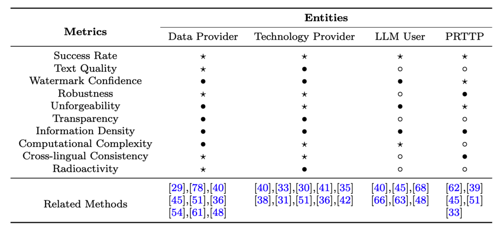



## 摘要
大语言模型（LLMs）在各个行业中的应用日益广泛，但也带来了因未授权复制和滥用而产生的重大安全风险。为了克服这些问题，健全的身份识别机制被广泛认为是一种有效的策略。目前，用于LLMs的身份识别系统主要依赖水印技术来管理和保护知识产权并确保数据安全。然而，先前的研究主要集中在水印算法的基本原理上，缺乏从LLMs身份识别角度对水印理论和实践的全面分析。为弥补这一差距，我们首先探讨了如何通过水印技术在各种LLMs参与者中有效地实施和管理健全的身份识别系统。其次，我们提出了一个基于互信息理论的数学框架，该框架系统化了识别过程，实现更精确和定制化的水印。另外，我们对LLM水印的性能指标进行了全面评估，反映了参与者的偏好，并推动了其在识别应用方面的讨论。最后，我们概述了当前水印技术和理论框架中存在的挑战，并提供了解决这些挑战的方向性指导。我们系统的分类和详细的阐述旨在增强各种方法的比较和评估，促进进一步研究和发展一个透明、安全和公平的LLM生态系统。
## LLM身份识别的现状
随着人工智能技术的飞速发展，大型语言模型（LLMs）已被广泛应用于自动化客户服务等复杂的自然语言处理任务中。然而，相应带来的安全性、合规性和用户隐私保护问题也日益严峻。各国已就AI安全问题展开了相关调研和立法准备，但完整的AI安全体系仍有待建立。
在传统安全体系中，如在金融交易、医疗保健、边境安全等领域中所见到的，身份识别与授权往往是其中的第一环和最为重要的一环。身份识别主要解决三个核心问题——身份的可区分性、身份的不可伪造性和身份的可追溯性。然而，在人工智能领域中，如何解决这三个问题 仍未有足够成熟的技术方案。
水印技术被普遍视为一种可能的解决方案。该技术能秘密地嵌入身份信息实现智能的可区分性，并通过集成加密技术来确保信息的不可伪造性，以及通过先进的检测技术实现信息的可追溯性。鉴于在复杂的LLM应用场景中保护知识产权和确保安全责任追溯的迫切需要，建立有效的水印嵌入和提取体系至关重要。
为促进LLMs的安全、透明和公平使用的技术发展，本文从应用、理论和评估三个主要方面对现有LLM水印系统展开综述。我们探索了数据提供者、技术服务提供者、用户和第三方监管机构在多中心LLM应用框架中对身份识别的不同需求和偏好。此外，我们还构建了基于互信息理论的水印理论体系以优化各个环节，并对LLM水印的性能提出了评估标准。总之，我们对人工智能身份识别系统的既有成果进行了综述，显著扩展了LLMs水印应用的范围，为解决LLMs在安全性和透明度方面的挑战提供了坚实的技术支持。

## 未来的LLM应用体系——以身份识别为核心的多中心体系
大语言模型（LLM）的全生命周期包括数据准备、训练、测试、部署和维护，涉及多个实体和利益相关方。随着计算能力和数据质量的提升，LLM迅速发展，但安全性和权益保护问题常被忽视。未来，社区将更重视合规监管和用户隐私，要求技术提供方确保操作透明性和安全性。这一转变过程如图1所示。
在多中心体系中，各参与方需在保护自身权益和提高收益间找到平衡。用户对隐私的担忧、数据提供方对数据被非法转卖的担心等问题依然存在。解决这些问题的关键在于实现实体间的可信合作，确保LLM的身份可识别和行为可追溯。
传统身份识别方法不适用于LLM生成的内容。水印技术能在不损害数据质量的前提下嵌入标识，确保LLM合法使用并防止未授权篡改。不同利益相关方可利用水印技术保护自身权益，如数据提供方保护数据版权；技术服务商保护模型版权，并追踪模型使用；用户用其保护个人隐私；公共监管机构则通过验证水印确保模型的安全性，确保在发现问题时能进行追溯和解决。

各方应根据自身在LLM应用体系中的地位和关系，使用水印技术建立身份识别和权益保护体系。表1总结了各方需要保护的权益对象、识别对象、使用水印技术时的限制和基本要求。各参与实体可根据表中描述，在不同阶段部署适合的水印方案。

| 参与实体 | 保护权益对象 | 识别对象 | 限制 | 基本要求 |
| :--- | :--- | :--- | :--- | :--- |
| **数据提供方** | 数据 | 数据购买方身份 | 不影响文本质量 | 防伪性、鲁棒性、透明性、高保真度、放射性、多位消息载荷 |
| **技术研发方** | 模型 | 模型用户身份 | 不影响模型训练过程 不影响文本质量 | 防伪性、鲁棒性、透明性、高保真度、放射性、多位消息载荷 |
| **大模型用户** | 用户隐私 | 是否含有个人隐私 | 黑盒水印，用户能力限制 | 防伪性、鲁棒性、水印API接口 |
| **公共监督&可信第三方** | 社区生态安全 | 开放互联网上的AI生成内容识别 | 水印可公开验证 | 防伪性、鲁棒性、高成功率 |

## 基于互信息的LLM水印理论体系

我们通过构建一个基于互信息理论的水印理论体系，为当前的AI身份识别体系建立了初步的数理基础。所提出的理论不仅建立了公式化框架，还将LLM水印技术分为如图2所示的五个关键步骤，涉及生成、嵌入、提取和重建等，而在水印文本的传输过程中则涉及可能存在的水印攻击步骤。

### 关键要素解释
*   **具有语义的原始生成序列 $S^N$**: 根据输入Prompt，LLM预测并生成的序列元素，我们认为水印的引入必须和原本的语义信息相关，才能完成不能破坏原始语义并嵌入水印的目的。

*   **水印消息 $m$**: 可分为一位或多位水印，后者允许传递更多定制身份信息但设计更为复杂。 只有富信息的多位水印，才可以编码身份识别信息。因此，多位水印消息的水印技术构建尤为重要。

*   **安全密钥 $K^D$**: 作为身份标签，既提供身份验证信息，也增强传输性能的随机性和可追溯性。
### 关键步骤描述
1. 在Generation阶段，通过编码函数将身份信息转换成适合嵌入的水印信号，保证水印算法的攻击鲁棒性和安全鲁棒性。
2. 在Embedding阶段，水印信号被嵌入到原始文本中，优化嵌入过程以最小化失真，保证水印透明性和生成文本质量。
3. 在Attack阶段，考虑非法攻击对嵌入水印的影响，限制失真度。
4. 在Extraction阶段，从带水印的文本中提取出水印信息。
5. 在Reconstruction阶段，使用优化解码规则从提取的水印信息中重构原始水印。

## LLM水印技术分类
如图3所示，根据上述的理论体系，我们将目前现有的水印相关研究划分为五个主要部分，并从理论上进行了详细说明。目前所有的LLM水印研究其本质上都是围绕这五个步骤进行的优化目标、约束目标以及优化方法的改进。

此外，本文首次针对水印的攻击方法进行了分类学研究。水印攻击不仅代表水印技术的潜在威胁，也可以作为评估水印技术鲁棒性的工具，从而帮助开发者改进和强化水印算法。考虑到攻击的预期目标，水印攻击被划分为四种主要类型：破坏、提取、伪造和操纵，如图4所示。

## 水印指标和评估体系
在LLMs中，构建一个全面和标准化的水印算法评价系统非常关键。本文从多个角度概述了评估LLM水印算法的关键指标，包括成功率、文本质量、水印置信度、透明度、不可伪造性、鲁棒性、信息密度、计算复杂性、跨语言一致性和放射性。这些指标的综合评估有助于全面了解水印算法的性能，从而指导未来的研究方向和LLM水印的实际应用。此外，这些指标构建的评价系统不仅指导研究人员选择或设计水印算法，而且在评估这些算法在现实场景中的可行性和有效性时发挥关键作用。同时，图5中的表格提供了LLM应用体系中四个实体对水印算法需求的不同侧重点，并根据他们的关注指标推荐适用的水印方法。

## 总结和未来展望
在本文中，我们全面探讨了LLM水印技术在LLM身份识别系统中的应用和影响。随着LLM在各行业的广泛应用，通过水印技术确保LLM身份识别的可区分性、不可伪造性和可追溯性变得尤为重要。当前的LLM应用系统主要围绕模型技术开发者，形成了技术壁垒和资源优势。我们认为未来将出现一个多中心的应用系统，涵盖数据提供者、模型开发者、可信第三方监管者和LLM用户。在这样一个多中心系统中，多个参与者可以通过基于水印的身份识别系统进行互利合作。
除了对水印方法进行了全面分析，我们还建立了一个以信息理论为中心的LLM水印技术数理体系，为相关研究和优化提供了坚实的理论基础。通过详细分类、数学描述和综合评价指标，研究者可针对不同参与者的偏好研究水印技术，并使用本文中的分类方法对相关研究进行比较和评估。我们期待本综述将有助于领域进一步探索更高效、更安全的识别技术，如富信息水印、非对称水印加密验证、抵御水印攻击，等等，以满足AI智能体身份识别领域日益复杂的应用需求和安全挑战。
