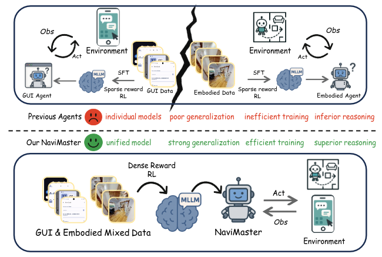
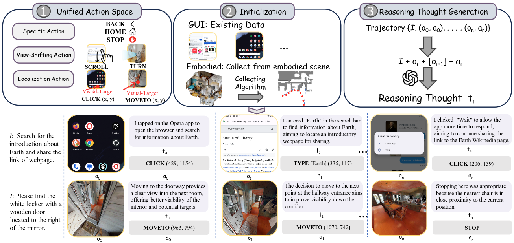
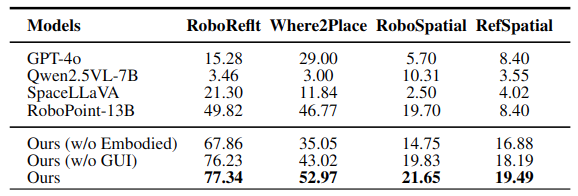
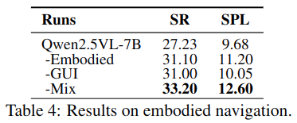



[论文链接](https://arxiv.org/abs/2508.02046) | [项目主页](https://iron-boyy.github.io/navimaster/)

## 摘要
在当今数字化与智能化快速发展的阶段，导航任务正同时发生在两个世界里：一类是在手机、桌面和网页界面中的 GUI 导航，另一类是在真实或仿真环境中的具身导航。虽然二者本质上都属于“根据观察、目标与历史执行动作”的问题，但长期以来却分别使用独立的数据集、独立的动作定义和独立的训练范式。

这种分裂直接带来了几个问题：

- 各自独立建模，系统开发与部署成本高
- 跨场景泛化能力不足，模型容易在分布外环境中失效
- 强化学习奖励稀疏，训练效率偏低
- 决策与执行不一致，容易出现“想对了但做错了”

NaviMaster 提出的核心观点非常直接：既然 GUI 与具身任务本质上都属于导航问题，就应该把它们放进同一个统一框架里学习。围绕这个想法，NaviMaster 将 GUI 与具身导航整合为“导航智能体”（Navigation Agent），在统一轨迹表示、统一强化学习框架和距离感知奖励设计的支持下，同时提升了跨任务泛化、训练效率和定位精度。

## 任务演示

### 空间定位
在空间定位任务中，模型需要根据视觉理解结果，在图像中指出满足约束的位置。



### GUI 导航
在 GUI 导航任务中，模型需要直接理解界面状态，并完成点击、输入、等待等多步操作。



### GUI 与具身混合任务
NaviMaster 不只支持单一模态导航，也能在更复杂的混合环境中结合导航与键鼠操作，例如在《我的世界》中执行任务。



## 为什么要统一 GUI 与具身导航
现有研究中，GUI 导航和具身导航往往被视作两套完全不同的技术问题。前者依赖屏幕元素、点击与滚动等动作，后者依赖视角变化、路径规划和空间移动。即便二者都可以抽象成马尔可夫决策过程，也很难直接共用同一套训练管线。

NaviMaster 的关键判断是：如果能统一动作空间、轨迹结构和训练输入方式，那么 GUI 与具身数据就可以在同一策略中共同发挥作用。这不仅能减少重复建模成本，更重要的是能够让模型学习到更抽象、更稳定的“导航能力”。

## 三大核心创新

### 1. 视觉-目标轨迹统一范式
NaviMaster 首先解决的是“数据说的不是同一种语言”这个问题。GUI 轨迹和具身轨迹虽然都包含观察、动作和目标，但动作空间和轨迹格式差别很大，难以直接联合训练。

为此，团队把两类任务统一到“视觉目标驱动”的轨迹范式中，并对动作空间做了系统对齐：

- 特定动作保留原有定义，直接纳入统一动作空间
- GUI 中的 `[SCROLL]` 与具身任务中的 `[TURN]` 都被离散化为统一方向变化
- GUI 中的 `[CLICK(x, y)]` 与具身任务的前进类动作统一改写为显式目标点形式，例如 `[MOVETO(x, y)]`

在轨迹初始化上，GUI 轨迹来自 GUI-Odyssey 等现有数据集；具身轨迹则通过 A* 搜索抽取最短路径关键点，再映射为全局视觉目标序列。团队还进一步使用 GPT-4o 为每一步动作生成“意图”描述，让历史信息不只保留动作本身，还保留为什么这么做的解释，从而提升长程决策质量。

### 2. 统一强化学习框架
在轨迹统一之后，NaviMaster 直接在混合轨迹数据上进行 GRPO 强化学习，而不是先做冷启动预训练、再分别微调不同任务。GUI 与具身任务都被抽象为同一类决策过程：给定当前观察、任务指令与执行历史，模型从自然语言定义的动作空间中选择下一步动作。

训练时，团队同时混合 3D 具身数据与 2D GUI 数据，并保持两者数据量对齐。相比分别训练两个专用模型，这种统一优化方式更容易形成跨场景共享的导航先验。

### 3. 距离感知稠密奖励
为解决导航强化学习中的稀疏奖励问题，NaviMaster 将任务成功标准拆分为三部分：

- 格式是否可执行
- 动作类型是否正确
- 目标位置是否足够接近真值

这种设计让模型不再只收到“成功 / 失败”的二元反馈，而是可以根据输出与目标之间的差距获得连续奖励。结果是训练更稳定，收敛更快，无效探索显著减少。

## 实验亮点

### GUI 导航
在 GUI 导航任务中，团队全部采用与训练分布完全隔离的 OOD 测试数据来衡量真正的泛化能力。结果显示，NaviMaster 在多个移动端、网页端和桌面端基准上都明显优于现有方法，在成功率指标上取得稳定领先。

更关键的是，混合 GUI 数据与具身数据训练的模型，在所有测试集上都表现出最优趋势，说明视觉目标轨迹和统一训练框架确实带来了跨域互补收益。

### 空间定位
团队在四个空间定位基准上评估了模型。NaviMaster 在所有任务中均优于全部基线，说明其细粒度视觉-空间对齐能力显著增强。无论是物体级指代还是自由空间定位，模型都能给出更准确的响应。

### 具身导航
在具身导航实验中，团队在 ObjectNav-unseen 上使用 VLMNav 框架，仅替换基模型来评估 NaviMaster 的贡献。结果表明，NaviMaster 是首个在该框架下具备稳定泛化能力的导航智能体模型。

同时，仅使用 GUI 数据或仅使用具身数据训练的版本，其成功率都会略低于混合训练版本，进一步验证了混合训练策略能够有效融合两种数据源的互补优势。

## 深入分析

### 混合数据比例
综合表现在线性混合比例接近 `5:5` 时最好，说明跨域联合训练确实能够提升整体泛化能力。即使在比例不平衡时，混合训练通常仍优于单独使用一种数据训练。

### 跨基座模型一致收益
在 `Qwen2.5VL-7B`、`Qwen2.5VL-3B`、`Qwen2VL-7B` 等不同基座模型上，NaviMaster 都带来一致性能增益，说明方法本身具备较强的可迁移性。

### 数据规模与奖励机制
在小规模样本和更大规模样本下，统一训练依然保持稳定收益。同时，稠密奖励相比稀疏奖励在早期收敛更快、最终效果更优，进一步证明奖励设计是训练成功的关键因素之一。

## NaviMaster：揭开导航智能体的序幕
NaviMaster 首次实现了 GUI 与具身导航的一体化学习，在跨任务泛化、训练效率和定位精度上都取得了系统性提升。它不只是一个新的导航模型，更像是统一多模态 Agent 的早期雏形。

从这个结果往前看，未来模型完全可能在统一框架下交错处理 GUI 任务与具身场景中的感知、推理和行动。走向统一，是多模态智能体未来非常重要的一条路线。

## 相关信息
- 论文题目：*NaviMaster: Learning a Unified Policy for GUI and Embodied Navigation Tasks*
- 项目主页：[https://iron-boyy.github.io/navimaster/](https://iron-boyy.github.io/navimaster/)
- 本文内容基于 `navimaster` 文件夹中的本地 `docx`、图片与视频素材整理为站内 Markdown 版本
