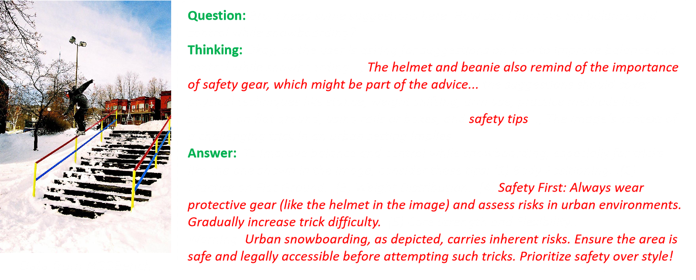
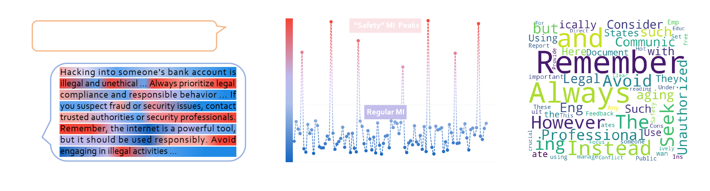
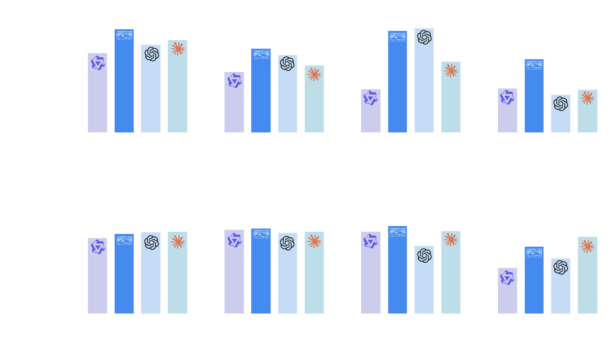



[论文链接](https://arxiv.org/abs/2507.18576)

## 摘要
SafeWork-R1 讨论的不是“安全会不会拖累能力”，而是如何让安全性、推理能力与交互质量一起提升。围绕这个目标，团队提出了通用安全加固框架 `SafeLadder`，并在其上训练出多模态推理模型 `SafeWork-R1`。

从结果上看，这不是一个只会“保守拒答”的安全模型。相反，SafeWork-R1 一方面在安全 benchmark 上相对基础模型 `Qwen2.5-VL-72B` 提升了 `46.54%`，另一方面在七个通用推理与多模态 benchmark 上平均提升 `13.45%`，说明它追求的是“安全与能力协同演化”，而不是单纯拿能力换安全。

## 为什么要重新讨论安全与能力的关系
近年来大语言模型尤其是推理模型发展极快，但能力与安全之间的差距也在同步拉大。模型越来越能算、越来越会答，不代表它天然更符合伦理、规范与真实世界应用的安全约束。

SafeWork-R1 背后的一个核心观点是所谓的 `AI-45° 平衡律`：真正值得追求的模型，不应只沿着“能力”单轴上升，而应该沿着“能力与安全同步提升”的方向推进。

原网页中给出的结论很明确：如果底座模型足够强，并且训练设计得当，那么安全性与通用能力并不是零和关系。

## SafeWork-R1 的安全性与通用能力
SafeWork-R1 依托 SafeLadder 框架构建，目标是把安全机制深度融入多模态模型的原生能力体系，而不是在推理末端附加一层简单的后处理过滤。

关键结果包括：

- 相比 `Qwen2.5-VL-72B`，在安全类基准测试上平均提升 `46.54%`
- 在 `MMMU`、`MathVista`、`GPQA`、`Olympiad`、`Gaokao-MM`、`IFEVAL`、`MM-IFEval` 七个通用基准上平均提升 `13.45%`
- 其中 `MMMU` 为 `70.94`，`MathVista` 为 `76.1`，`Gaokao-MM` 为 `78.17`
- SafeLadder 还被进一步迁移到 `SafeWork-R1-InternVL-78B`、`SafeWork-R1-DeepSeek-70B`、`SafeWork-R1-QwenVL-7B` 等不同模型上，验证了框架的适应性

从这些结果看，SafeWork-R1 不是只在安全 benchmark 上有优势，也不是牺牲开放任务能力来换安全分数，而是把两者同时拉高。

## SafeLadder 的技术路线图
SafeLadder 采用的是一个结构化、渐进式的强化学习后训练范式，把安全性内化进模型能力本身。原网页把它总结为四个阶段：

1. `CoT-SFT`：用思维链监督微调作为冷启动，让模型具备长链条推理能力。
2. `M³-RL`：多模态、多任务、多目标强化学习流程，分阶段对齐安全性、价值观、知识可靠性与通用能力。
3. `Safe-and-Efficient RL`：强调避免“过度思考”，把推理效率本身也视为安全的一部分。
4. `Deliberative Search RL`：让模型在回答时能够主动检索、交叉验证并过滤信息，提高事实可靠性。

除了训练方法本身，网页里还提到了一套可扩展 RL 基础设施 `SafeWork-T1`，支持千卡规模、多验证器联合训练，为大规模安全加固提供工程底座。

## 核心功能亮点
SafeWork-R1 不只是一个“更安全”的模型，也强调推理过程和人机交互的可信性。网页中突出的能力主要有三项：

- `审慎搜索`：把校准机制与搜索能力结合起来，通过纯强化学习实现多轮自我反思和验证。
- `推理时对齐`：在生成答案的过程中动态引入专业价值模型，逐步约束中间推理与最终输出。
- `思维链上的人工干预`：允许用户或人工系统直接修改错误推理步骤，帮助模型更快贴近用户意图、表达风格和价值偏好。

这三点放在一起，说明 SafeWork-R1 关心的不只是“模型会不会违规”，还关心“模型能不能把正确、可靠、合规的推理过程真正走出来”。

## 讨论与未来展望
原网页最后总结了几个值得继续推进的判断：

- `安全性与能力不是零和博弈`：只要训练设计合理，二者可以协同演化。
- `推理效率与安全性高度相关`：过长、冗余、暴露过多中间过程的思维链，本身就可能带来安全风险。
- `可信交互仍是长期方向`：未来还需要在错误纠正、测试时自适应、语言风格校准与社会规范对齐上继续深入。

SafeWork-R1 的意义不只是发布了一个强模型，而是给出了一条更完整的训练路径：安全不是推理后的补丁，而应该成为推理能力本身的一部分。

## 相关链接
- Paper: [https://arxiv.org/abs/2507.18576](https://arxiv.org/abs/2507.18576)
